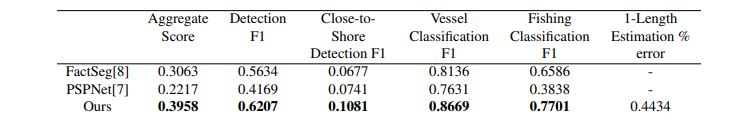
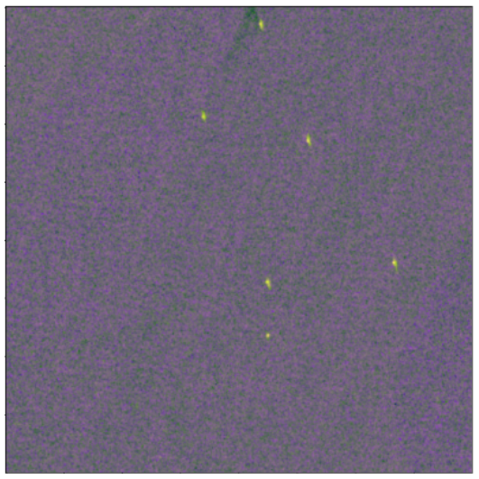
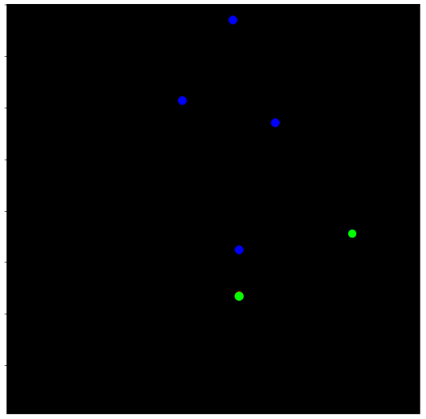
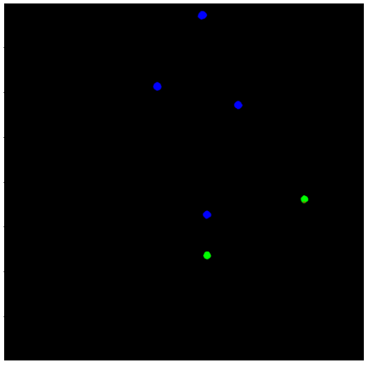
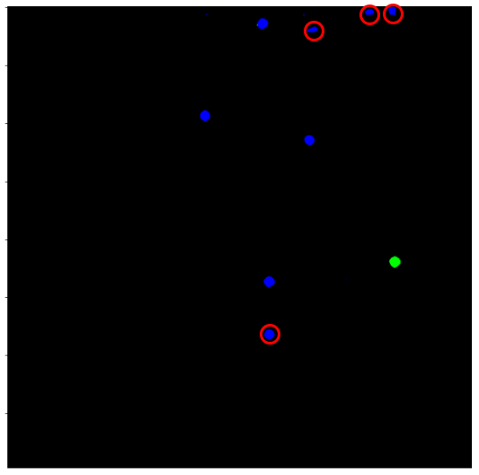
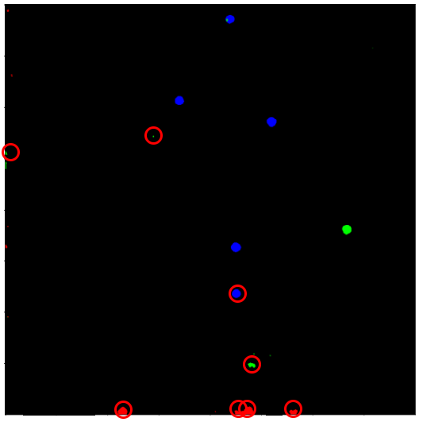
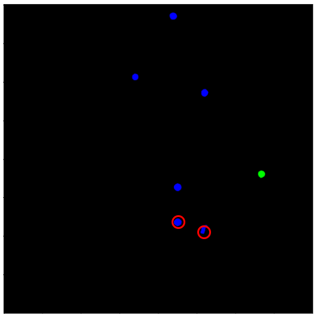

# DEEPSAR: VESSEL DETECTION IN SAR IMAGERY WITH NOISY LABELS


Our proposed training pipeline. The input SAR image bands are converted to false-color RGB, and then the FPN architecture is used to extract multi-resolution features combined using the Upsampling Stage to create high-resolution 
        128-dimensional pixel-level feature vectors. The extracted features are then used to predict foreground regions using a Foreground-Background (FB) classifier head (class-agnostic detector). Finally, the predicted foreground regions 
        and feature vectors are used to predict the semantic segmentation map using a Semantic Segmentation (SS) head.

## ABSTRACT

Unlike traditional optoelectronic satellite imaging, Synthetic Aperture Radar (SAR) allows remote sensing applications to operate under all weather conditions. This makes it uniquely valuable for detecting ships/vessels involved in 
        illegal, unreported, and unregulated (IUU) fishing. While recent work has shown significant improvement in this domain, detecting small objects using noisy point annotations remains an unexplored area. In order to meet the unique challenges 
        of this problem, we propose a progressive training methodology that utilizes two different spatial sampling strategies. Firstly, we use stochastic sampling of background points to reduce the impact of class imbalance and missing labels, and 
        secondly, during the refinement stage, we use hard negative sampling to improve the model. Experimental results on the challenging xView3 dataset show that our method outperforms conventional small object localization methods in a large, noisy 
        dataset of SAR images.

## Performance


Comparison of our approach with state-of-the-art methods for small object localization and generic object localization on the validation split of the xView3 dataset.

## Visualization
{: width="250"} {: width="250"} {: width="250"} {: width="250"} {: width="250"} {: width="250"}

### Markdown

Markdown is a lightweight and easy-to-use syntax for styling your writing. It includes conventions for

```markdown
Syntax highlighted code block

# Header 1
## Header 2
### Header 3

- Bulleted
- List

1. Numbered
2. List

**Bold** and _Italic_ and `Code` text

[Link](url) and 
```
