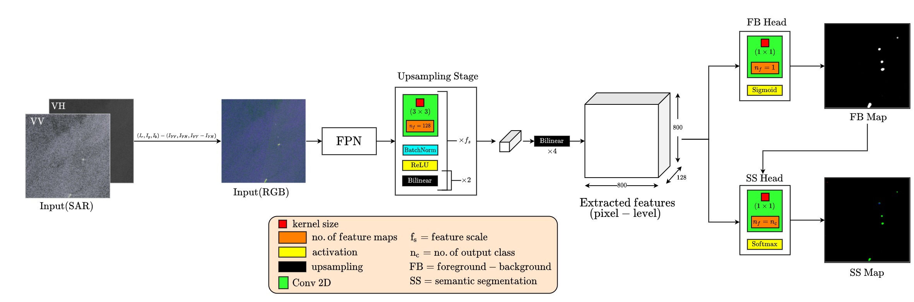

### DEEPSAR: VESSEL DETECTION IN SAR IMAGERY WITH NOISY LABELS



## ABSTRACT

Unlike traditional optoelectronic satellite imaging, Synthetic Aperture Radar (SAR) allows remote sensing applications to operate under all weather conditions. This makes it uniquely valuable for detecting ships/vessels involved in 
        illegal, unreported, and unregulated (IUU) fishing. While recent work has shown significant improvement in this domain, detecting small objects using noisy point annotations remains an unexplored area. In order to meet the unique challenges 
        of this problem, we propose a progressive training methodology that utilizes two different spatial sampling strategies. Firstly, we use stochastic sampling of background points to reduce the impact of class imbalance and missing labels, and 
        secondly, during the refinement stage, we use hard negative sampling to improve the model. Experimental results on the challenging xView3 dataset show that our method outperforms conventional small object localization methods in a large, noisy 
        dataset of SAR images.

### Markdown

Markdown is a lightweight and easy-to-use syntax for styling your writing. It includes conventions for

```markdown
Syntax highlighted code block

# Header 1
## Header 2
### Header 3

- Bulleted
- List

1. Numbered
2. List

**Bold** and _Italic_ and `Code` text

[Link](url) and 
```

For more details see [Basic writing and formatting syntax](https://docs.github.com/en/github/writing-on-github/getting-started-with-writing-and-formatting-on-github/basic-writing-and-formatting-syntax).

### Jekyll Themes

Your Pages site will use the layout and styles from the Jekyll theme you have selected in your [repository settings](https://github.com/Tanmay98/Deep_SAR/settings/pages). The name of this theme is saved in the Jekyll `_config.yml` configuration file.

### Support or Contact

Having trouble with Pages? Check out our [documentation](https://docs.github.com/categories/github-pages-basics/) or [contact support](https://support.github.com/contact) and we’ll help you sort it out.
